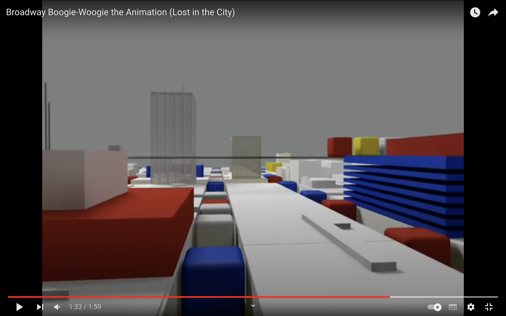
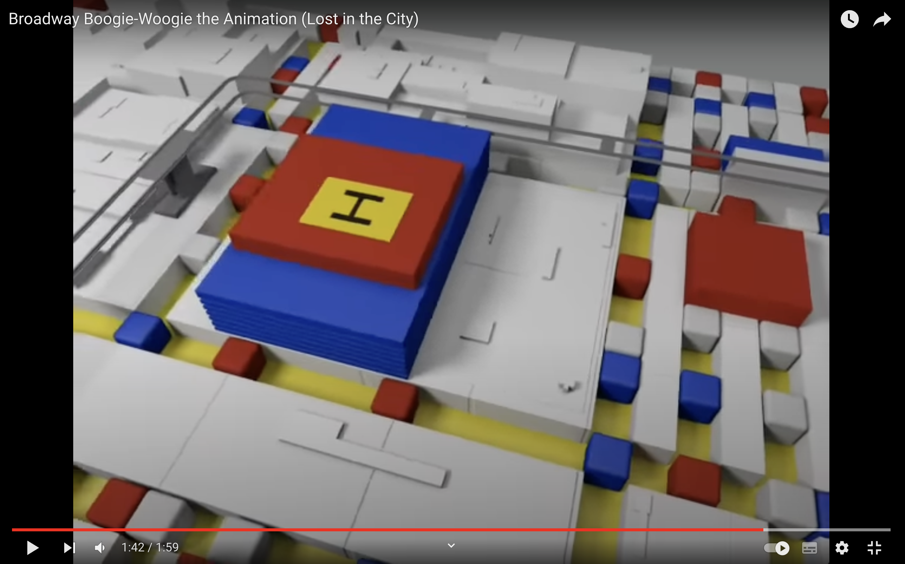
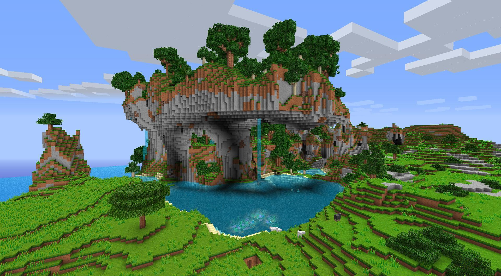
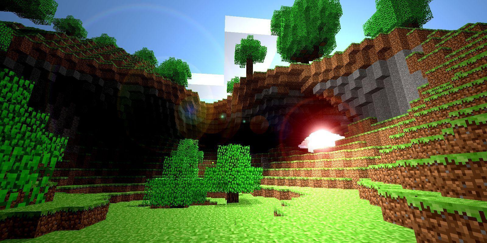
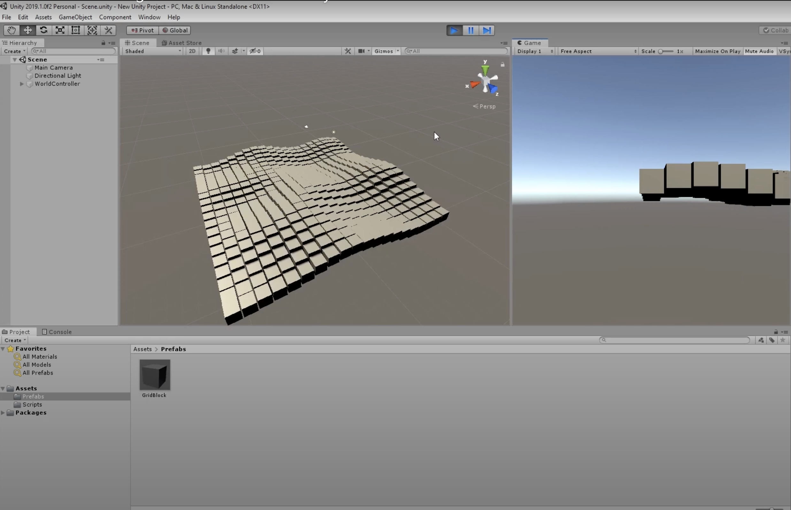
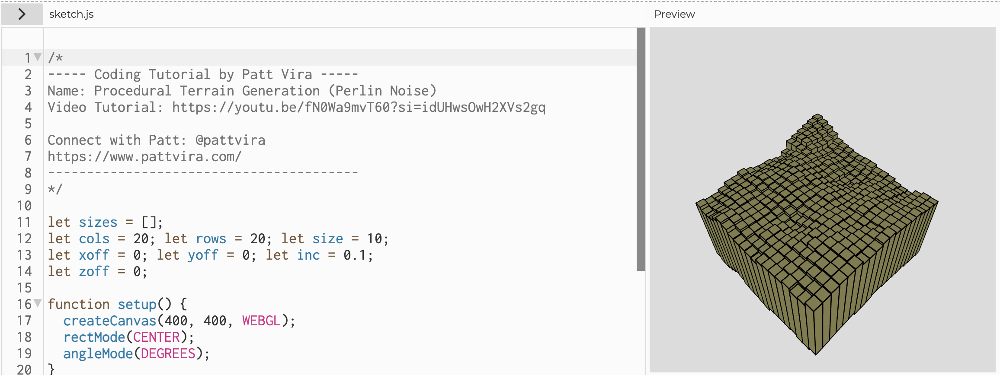

# aset0894_9103_TUT10

## Week 8 Quiz 

### Part 1: Imaging Technique Inspiration 
Since I am interested in the Boogie-Woogie painting, I attempted to find an imaging technique that could elevate its geometric patterns. From the Boogie-Woogie painting’s 3D animation, I discovered that <strong>3D reconstruction</strong> can add a variation of depths for each geometric element and make the initial flat rectangles in the painting pop up. 

(Broadway Boogie-Woogie the Animation (Lost in the City), 2010)

[Link to 3D animation of Boogie-Woogie painting](https://www.youtube.com/watch?v=4b85UBqUy28&ab_channel=TungPham)

Furthermore, the Minecraft world also inspired me to execute the 3D reconstruction technique with height map. Minecraft’s environment is built using varying heights of blocks to create the 3D effect. This technique could be implemented to <strong> create an interesting adaptation while emphasising the geometric elements of the painting.</strong>

(Awaldner, n.d.)

 

### Part 2: Coding Technique Exploration

The coding technique that can be implemented to create such imaging technique is <strong>3D procedural generation using Perlin noise</strong>. The 3D world generated using the pseudo-random height of blocks based on this technique can be used as a starting point to construct the 3D version of the Boogie-Woogie painting. Drawing inspiration from Perlin noise procedural generation done in Unity, I can break down the painting into different layers and add varying height to each layer containing various geometric elements. 

[Link to Perlin Noise's procedural generation code in Unity](https://adrianb.io/2014/08/09/perlinnoise.html)

Additionally, I can incorporate Perlin noise to the colors as well and transform the 2D painting into a playful 3D world.

[Link to Perlin Noise's procedural generation code in p5js](https://editor.p5js.org/pattvira/sketches/AYp1dlGoU)

  

Reference

Awaldner. (n.d.). [Minecraft world backgrounds]. Retrieve May 2, 2024, from https://wallpapercave.com/w/wp3174099

Pham, T. (2010). *Broadway Boogie-Woogie the Animation (Lost in the City)* [Video]. YouTube. https://www.youtube.com/watch?v=4b85UBqUy28&ab_channel=TungPham